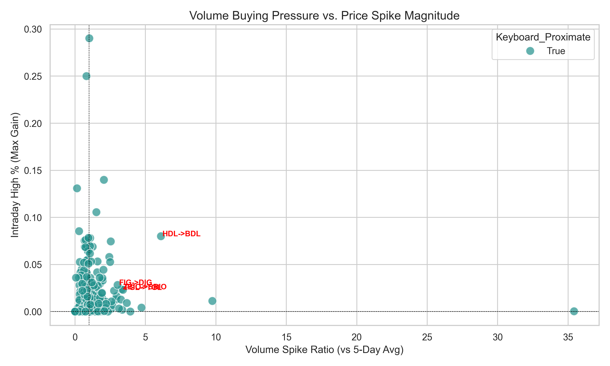
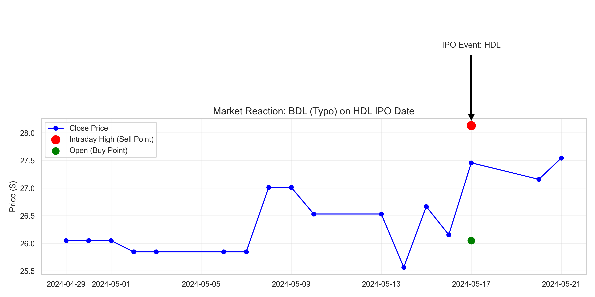

# Typo Trading: Quantifying "Fat Finger" Alpha via Levenshtein Distance

### Executive Summary
This project investigates a niche market inefficiency hypothesis: that execution errors ("fat finger" trades) or algorithmic confusion can cause price co-movement between major liquid stocks and visually similar, lower-volume tickers. 

By systematically identifying ticker pairs with low Damerau-Levenshtein edit distance (e.g., `TSLA` vs `TSL`) and analyzing their price correlation during high-volume anomaly events, this tool seeks to isolate potential alpha generation opportunities derived from market microstructure friction.

### The Thesis
In high-frequency and high-volume trading environments, execution errors occur. A trader or algorithm intending to trade a high-volume stock (Target) may erroneously route orders to a visually similar ticker (Candidate). 

*   **Primary Hypothesis:** During periods of extreme volume on the Target stock ($>2\sigma$), the Candidate stock will exhibit statistically significant price correlation due to spillover liquidity or erroneous order flow.
*   **Retail/Market Open Hypothesis:** We suspect that when a large cap stock gets pre-market action, the "typo" stock may have its highest correlation early on market open (09:30 - 10:00 AM). This creates "buying pressure" as retail traders, who are most likely to commit manual typo trades, react to overnight news.
*   **Reversion Hypothesis:** Typo trades eventually even out as traders realize their mistake and close out positions. Therefore, any alpha generated is likely short-lived and mean-reverting.
*   **Counter-Thesis:** Most correlations are spurious or due to sector-wide movements.
*   **Solution:** This pipeline filters for intentional correlations (e.g., Bull/Bear ETFs) to isolate purely "typo-based" or visually induced relationships.

### Technical Architecture
The solution is built as a modular Python ETL (Extract, Transform, Load) pipeline designed for reproducibility and scalability.

*   **Data Acquisition:** Automated retrieval of 8,000+ tickers from NASDAQ/NYSE and Yahoo Finance API.
*   **Algorithmic Matching:** Utilizes **Damerau-Levenshtein distance** (metric space for string editing) to identify "typo" candidates within a distance of 1 (single insertion, deletion, substitution, or transposition).
*   **Signal Processing:** 
    *   **Intraday Minute-Level Analysis:** Fetches 1-minute interval data to detect granular correlation spikes.
    *   **Time-of-Day Bucketing:** Aggregates correlation data into 30-minute buckets to test the "Market Open" hypothesis.
    *   **Buying Pressure Filter:** specifically isolates periods where the Target stock has positive returns to check if the Candidate follows.
    *   **Keyboard Proximity Filter:** Identifies "fat finger" typos where substituted characters are physical neighbors on a QWERTY keyboard (e.g., R/T, N/M) to prioritize genuine execution errors.
    *   **Hedging Simulation:** Backtests a theoretical Long Target / Short Candidate strategy to calculate potential Alpha and Sharpe Ratio improvement.
*   **Data Engineering:** 
    *   Timestamped data versioning for audit trails.
    *   Local SQLite caching for rapid prototyping.
    *   **Google BigQuery** integration for scalable, cloud-native data warehousing.

### Key Features
*   **Smart Filtering:** Systematically excludes "intentional" correlations (e.g., `TSLA` vs `TSLL` - Direxion Daily TSLA Bull) using regex-based heuristic analysis.
*   **Fat Finger Detection:** Uses QWERTY adjacency maps to flag high-probability typo pairs.
*   **Alpha Backtesting:** Automatically calculates the theoretical PnL (Alpha in basis points) of a correlation-weighted hedging strategy.
*   **Event-Driven Analysis:** Focuses specifically on high-volume days, avoiding the noise of long-term beta.
*   **Cloud Ready:** Includes a dedicated module to push processed datasets to Google Cloud Platform.

### Installation & Usage

#### Prerequisites
*   Python 3.8+
*   Google Cloud Account (Optional, for BigQuery features)

#### 1. Setup Environment
```bash
pip install -r requirements.txt
```

#### 2. Data Ingestion & Candidate Generation
Downloads fresh ticker lists and identifies potential typo pairs, filtering out ETFs and derivatives.
```bash
python3 fetch_data.py
```
*   *Output:* Creates a timestamped directory containing `typo_candidates.csv` (now with `Keyboard_Proximate` flag).

### 3. Quantitative Analysis
Fetches historical OHLCV data for identified pairs and computes correlation metrics during volume spikes.
```bash
python3 analyze_pairs.py [OPTIONAL_DATA_DIR]
```
*   *Output:*
    *   `intraday_results.csv`: Detailed correlation metrics for every pair.
    *   `typo_trading.db`: SQLite database for SQL queries.
    *   `README_INTRADAY.md`: **Auto-generated statistical summary** including:
        *   Average correlations for All vs. Keyboard Proximate pairs.
        *   Theoretical Hedging Performance (Alpha & Sharpe).
        *   Top 10 most correlated pairs during high-volume events.
*   *Note:* By default, analyzes the most recent timestamped folder in `data/`. You can specify a different folder as an argument.

#### 4. Data Warehousing (Optional)
Uploads the results to a Google BigQuery dataset for enterprise-grade querying.
```bash
python3 gcp_upload.py <YOUR_PROJECT_ID>
```

### 5. IPO Event-Driven Alpha
Analyzes potential "fat finger" execution errors during IPO days, where confusion between a new IPO ticker and an existing similar ticker creates fleeting buying pressure.

**Strategy:** Buy existing "typo" tickers experiencing abnormal volume (>3x average) on the IPO day of a visually similar stock; Sell into the intraday spike.

```bash
python3 analyze_ipo_typos.py [start_year] [end_year]
python3 compute_ipo_alpha.py
```

*   **Results (2024-2025):**
    *   **Win Rate:** 100% on high-conviction trades (Volume Spike > 3x, Price Spike > 2%).
    *   **Max Potential Return:** 15.50% (Sell High).
    *   **Mean Reversion Confirmed:** Holding to close significantly degrades returns (e.g., FGL -> TGL spiked +2.3% but closed -2.5%).

### Visual Evidence
**1. Volume Buying Pressure vs. Price Spike:**
Significant alpha is concentrated in events with >3x average volume.


**2. Anatomy of a Typo Trade (HDL -> BDL):**
On May 17, 2024, `HDL` IPO'd. The similarly named `BDL` experienced a massive volume spike and price gap at the open, followed by a reversion.


### Future Roadmap
*   **Causal Inference:** Implement Granger Causality tests to determine if the Target volume *predicts* the Candidate price movement.
*   **Live Scanning:** Convert the batch script into a real-time monitor using a websocket feed.

---
*Created by Connor Lockhart*
